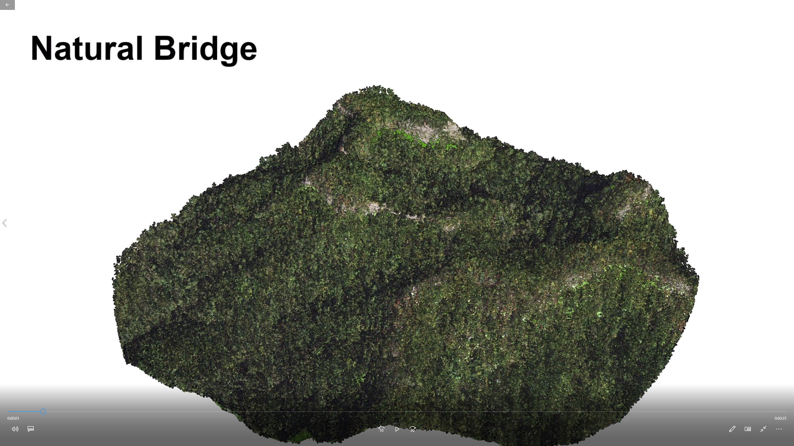
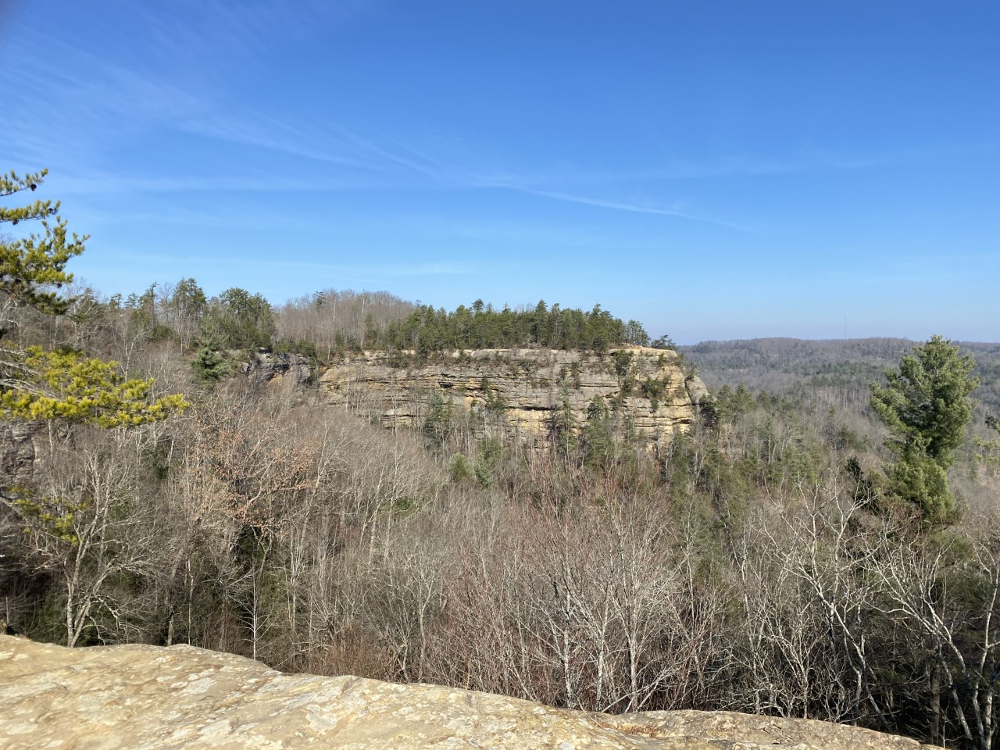
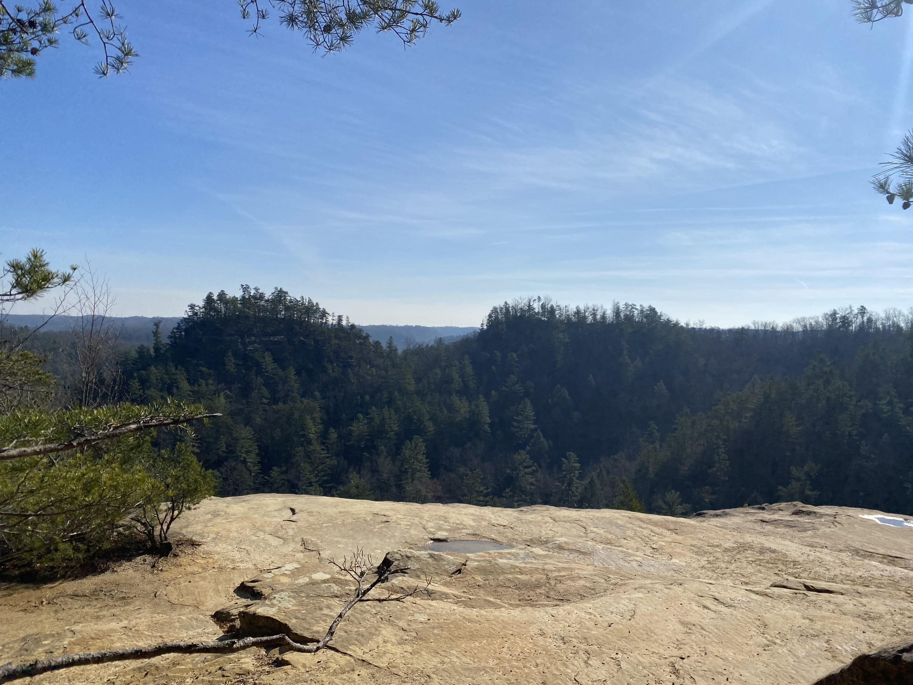
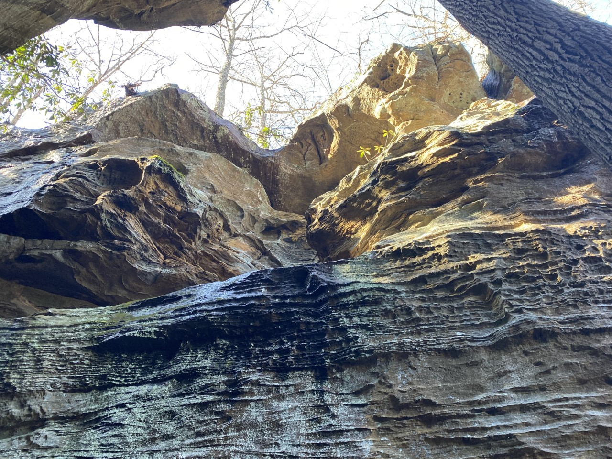

# Natural Bridge
Natural Bridge is located in Natural Bridge state park, KY

https://ktholbrook.github.io/nb/

## Introduction

Natural Bridge is located in Powell and Wolfe county in Natural Bridge state park at 37.7769 N, 83.6884 W. This site is a popular hiking site in the region as it has many trails of various length, all with a great view of the area.

## Goals

The goal of this Project is to show off Natural Bridge and its elevation along with other photos of the region. 
## Animation of Natural Bridge

[View Video of Animation](https://youtu.be/ASRgWDsIjYM)

The following video is an animation of Natural bridge using lidar data.

## Contour Map of Natural Bridge

Follow [this link](https://api.mapbox.com/styles/v1/ktho228/ckombkvvn17y217qrtt4l5ucb.html?fresh=true&title=view&access_token=pk.eyJ1Ijoia3RobzIyOCIsImEiOiJja28wZ3V3Y20wYmdnMm9sY3JmMHh1ZTJiIn0.-taUs202U-vXy4TGYsQg0A) to see the Mapbox map of Natural Bridge and Battleship rock.

## Photos

View from Natural Bridge, photo by Ken H

View from Battleship Rock, photo by Ken H

Below Battleship Rock, photo by Ken H

## Sources and tools

The following maps were produced by Ken Holbrook for the University of Kentucky Department of Geography, Spring 2021. This web page is the final project of GEO 409.

THe elevation data used was acquired from Kentucky's Elevation Data & Aerial Photography Program (kyfromabove.ky.gov). Aerial Imagery was acquired from the National Agriculture Imagery Program (NAIP) stored on public FTP server maintained by Kentucky Division of Geographic Information (DGI).

ArcGis Pro and other surface tools were used to create various maps and data for this project.